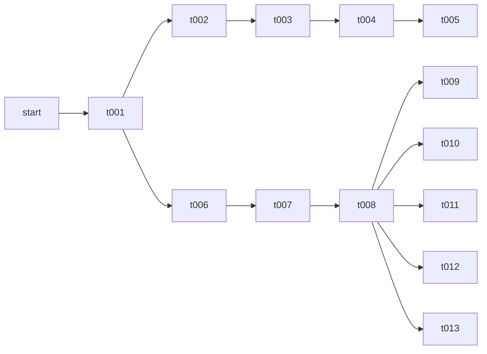

A rust implementation for taking on the 1 Billion Row Challange

You can run all the test with `cargo test` or a specific test with `cargo test 001` to run the test inside `./src/t001_basic.rs`.
To compare the versions run `cargo bench` and open the file `./target/criterion/1brcs/report/index.html` in your preffered browser to view the results.
For this to work you must have the [1brc](https://github.com/gunnarmorling/1brc) repo cloned in a directory next to this one, i.e. your folder structure is as follows:
```
some_dir/
    rust_1BRC
    1brc
```

## Versions
The syntax for the code block below is
`v1 --> v2`
with v1 the verion that was copied and modified, becoming v2 

